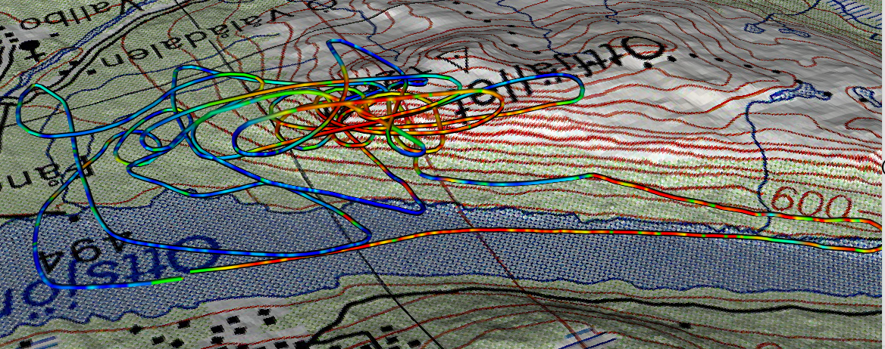
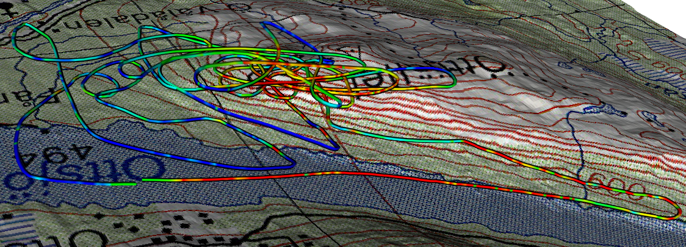

# VTK - Labo 4

- Gildas Houlmann
- Thibaud Franchetti

## Installation

```
pip install -r requirements.txt
```

## Usage

S'assurer du bon mapping des différents fichiers sources (modifiable dans `constants.py`) et lancer avec :

```
python labo4.py
```

### Pondération de la différence d'altitude pour le parcours du planeur

Comme les mesures ne sont pas prises à intervalles réguliers, il est possible de pondérer chaque différence d'altitude utilisée pour représenter les flux d'air par le temps entre deux mesures. Le but de cette approche était de mieux représenter les flux en s'assurant que des valeurs aberrantes n'apparaissent pas à cause d'un écart de temps trop important.

Cette option est désactivée par défaut car les résultats sont plus proches de la présentation du laboratoire.

Néanmoins, comme l'implémentation était déjà faite et pour le seul plaisir de la science, il est possible de l'activer en changeant la ligne suivante du fichier `constants.py` :

```Python
GLIDER_PATH_WEIGHTED_SEGMENTS = True
```

#### Pondération désactivée


#### Pondération activée




